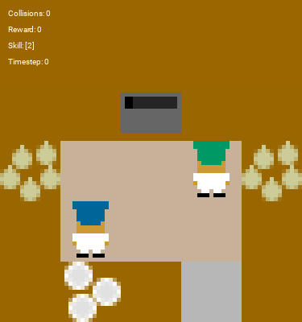

# Partner-Aware Hierarchical Skill Discovery for Robust Human-AI Collaboration

## Results

Below are visualizations showing **partner-conditioned skill evolution** during evaluation in two layouts: **Cramped Room** and **Coordination Ring**. For each layout, we present **side-by-side comparisons** of HiPT and PASD to illustrate differences in skill selection and adaptive behaviors.

---

### Cramped Room Evaluation

The following GIFs illustrate how a **HiPT agent (left) and a PASD agent (right)** adapt their skills when partnering with the same self-play agent in the Cramped Room layout.

| HiPT | PASD |
|------|------|
|  |  |

**Skill evolution strips:**  

| HiPT | PASD |
|------|------|
|  |  |

**Observations:**  
- PASD adapts dynamically to partner behaviors, showing diverse skill sequences.  
- HiPT exhibits fewer skill switches and less partner-aligned adaptation.  
- Skill strips highlight that PASD maintains **distinct, consistent skills** over time, while HiPT shows partial skill collapse.

---

### Coordination Ring Evaluation

Side-by-side comparison of **HiPT and PASD** in the Coordination Ring layout.

| HiPT | PASD |
|------|------|
|  |  |

**Skill evolution strips:**  

| HiPT | PASD |
|------|------|
|  |  |

**Observations:**  
- PASD captures partner-preferred coordination patterns and executes smooth, consistent skill sequences.  
- HiPT struggles to differentiate partner strategies, leading to delayed adaptation.  
- Skill strips demonstrate **clear partner-aware skill separation** in PASD versus partial skill overlap in HiPT.
